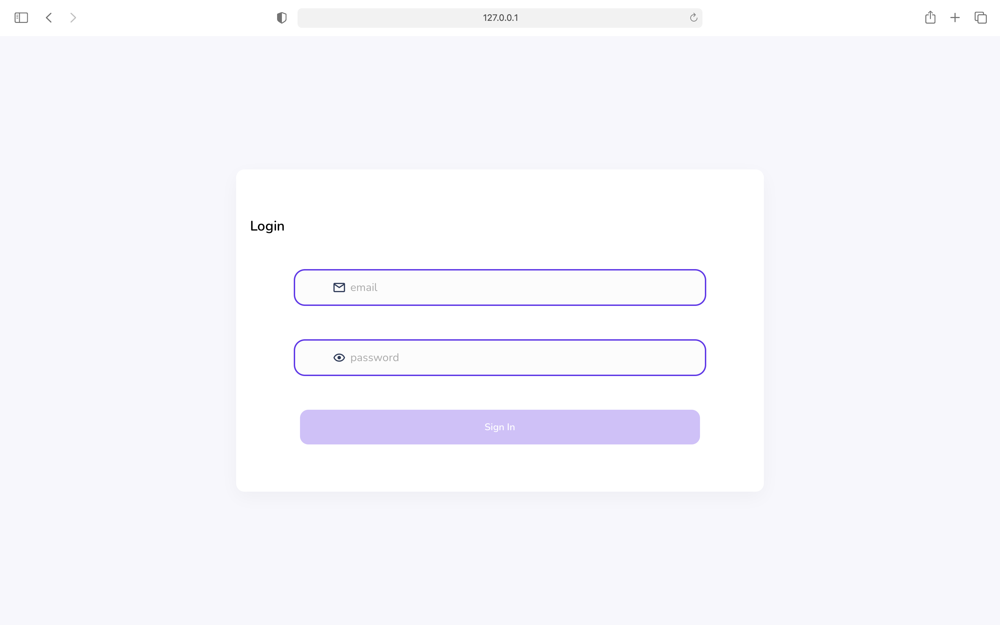

# Less CRM Project

## This is a project aimed at making a custom CRM application for handling service requests, sales leads management, client management and inventory managment.

## Built with 
* React
* React-Redux
* Styled Components
* React-Fetch
* React-Redux-Thunk
* Hooks
* Functional Components
* React Framer Motion API
* Create React App Architecture

Login Page.

Product Management page with list down and edits.

## Feature Coverage

1. Authentication API
    - [x] User Login
    - [x] User Registration
    - [x] User delete account request

2. Service Management API
   - [x] Add Service
   - [x] Update Service
   - [x] Delete Service
   - [x] Fetch Service

3. User Actions API
   - [x] Fetch All Users

4. Client Management API
   - [x] Add Clients
   - [x] Fetch Clients
   - [ ] Delete Clients
   - [ ] Update Clients
   - [x] Add Subclients
   - [x] Fetch SubClients
   - [ ] Delete SubClients
   - [ ] Update SubClients

5. Product Management API
   - [x] Add Products
   - [ ] Fetch Products
   - [ ] Delete Products
   - [ ] Update Products

6. Sales Management API
   - [ ] Add Sales Lead
   - [ ] Delete Sales Lead
   - [ ] Update Sales Lead
   - [ ] Fetch Sales Lead

7. Dashboard and Analytics API
   - [ ] Service Management
   - [ ] Sales Lead Management
   - [ ] Inventory Management
   - [ ] Client Management
